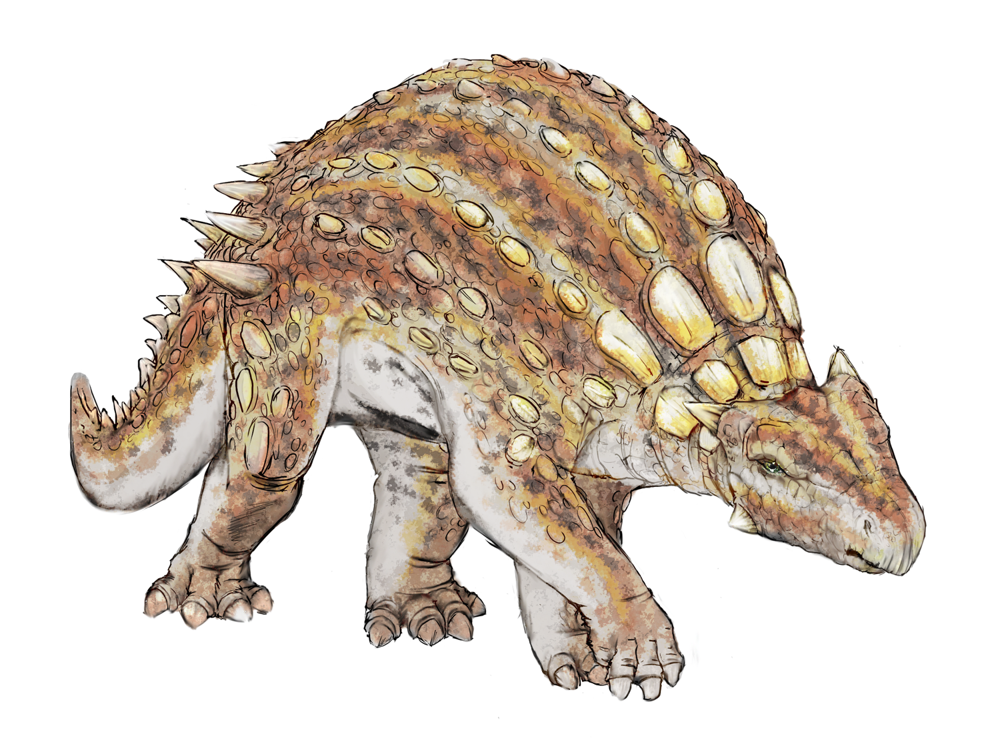

# Minmi

Welcome to Minmi demo site!

Minmi is a tiny wiki engine with [Zettelkasten](zettelkasten.md) flavor.

## Features

- Turns a folder of markdown files into a wiki site
- Tracks and displays [backlinks](backlinks.md) on pages
- Extracts `yaml` [frontmatter](frontmatter.md) frontmatter from markdown files
- Minimal and customizable [styles](customize/styles.md)
- Customizable [templates](customize/templates.md) using
  [Eta](https://eta.js.org/)

See also: [Use cases](use-cases.md)
